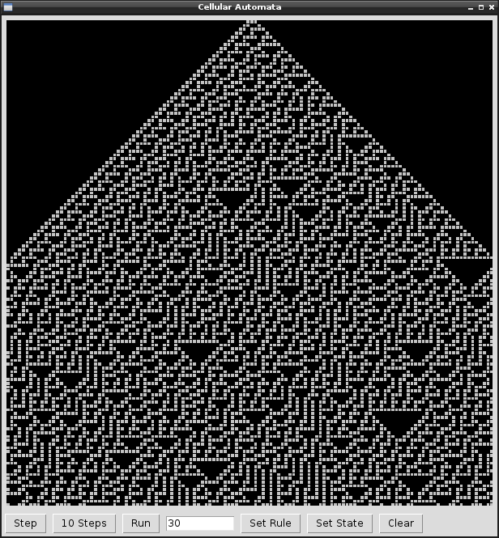

# Cellular Automata

The [Cellular Automata](http://en.wikipedia.org/wiki/Elementary_cellular_automaton) is a visual model based on a very simple algorithm where every state of the world depends on the previous state and a state rule.
